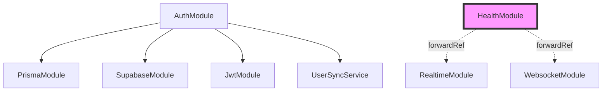

# NestJS 백엔드 아키텍처 분석 보고서

> 작성일: 2025-01-19  
> 분석 범위: Todo Master 백엔드 프로젝트  
> 주요 관점: 오버엔지니어링 식별 및 개선 방안

## 목차

1. [전체 평가 요약](#전체-평가-요약)
2. [프로젝트 구조 분석](#프로젝트-구조-분석)
3. [주요 오버엔지니어링 이슈](#주요-오버엔지니어링-이슈)
4. [모듈별 상세 분석](#모듈별-상세-분석)
5. [개선 로드맵](#개선-로드맵)
6. [결론 및 권고사항](#결론-및-권고사항)

## 전체 평가 요약

### 아키텍처 품질 점수: 6.5/10

#### 강점
- ✅ NestJS 표준 패턴 준수
- ✅ 명확한 모듈 분리
- ✅ TypeScript 타입 안전성
- ✅ 일관된 에러 처리

#### 약점
- ❌ 과도한 추상화
- ❌ 불필요한 복잡성
- ❌ 미완성 구현 (Phase 2 테스트)
- ❌ 중복된 기능 (인증, 실시간 통신)

## 프로젝트 구조 분석

### 기술 스택
```yaml
Framework: NestJS 11.x
Language: TypeScript 5.x
Database: PostgreSQL (Supabase)
ORM: Prisma 6.x
Auth: Supabase Auth + JWT (이중 구조)
Realtime: WebSocket + Supabase Realtime (중복)
Testing: Jest 29.x + 복잡한 Adapter 패턴
```

### 모듈 구성

#### 핵심 비즈니스 모듈
- `UsersModule` - 사용자 관리
- `GoalsModule` - 목표 관리
- `PlansModule` - 계획 관리
- `AuthModule` - 인증/인가

#### 인프라 모듈
- `PrismaModule` - 데이터베이스 ORM (@Global)
- `SupabaseModule` - Supabase 클라이언트 (@Global)
- `WebsocketModule` - WebSocket 통신
- `RealtimeModule` - Supabase Realtime
- `HealthModule` - 헬스체크

#### 공통 모듈
- `LoggerModule` - 커스텀 로깅 (@Global)
- `ConfigModule` - 환경설정

### 의존성 관계 문제



**순환 의존성 문제**: HealthModule에서 forwardRef() 사용

## 주요 오버엔지니어링 이슈

### 1. 이중 인증 체계 (Severity: High)

#### 현재 구조
```typescript
// 3개의 Guard + 2개의 인증 시스템
- JwtAuthGuard
- SupabaseAuthGuard  
- CombinedAuthGuard (JWT + Supabase 동시 지원)
```

#### 문제점
- 두 인증 시스템을 동시에 지원하는 불필요한 복잡성
- refreshToken을 bcrypt로 해싱 (JWT 자체가 이미 서명됨)
- DB 장애 대응 로직이 모든 메서드에 산재
- 인증 실패 시 두 번의 검증 시도로 성능 저하

#### 개선안
```typescript
// 단일 인증 체계로 통합
- Supabase Auth를 메인으로 사용
- JWT는 레거시 지원용으로만 유지
- Guard를 하나로 통합
```

### 2. Phase 2 Dual-Mode Testing (Severity: Critical)

#### 현재 구조
```
test/
├── adapters/          # 복잡한 어댑터 패턴
│   ├── auth/         # Mock만 구현
│   ├── storage/      # Mock만 구현
│   └── realtime/     # Mock만 구현
├── helpers/
│   └── dual-mode-runner.ts  # 사용 안 됨
└── config/
    ├── jest.unit.config.js      # 중복
    ├── jest.integration.config.js # 중복
    └── jest.e2e.config.js        # 중복
```

#### 문제점
- Real 모드 미구현 (TODO 주석만 존재)
- 175개 테스트 모두 Mock에서만 실행
- DualModeRunner 미사용
- 8개의 setup 파일 (대부분 환경변수 설정만)
- 투자 대비 효용성 제로

#### 개선안
```javascript
// 단일 Jest 설정으로 통합
module.exports = {
  projects: [
    { displayName: 'Unit', testMatch: ['**/*.spec.ts'] },
    { displayName: 'Integration', testMatch: ['**/integration/*.spec.ts'] },
    { displayName: 'E2E', testMatch: ['**/*.e2e-spec.ts'] }
  ]
};
```

### 3. 실시간 통신 중복 (Severity: Medium)

#### 현재 구조
```typescript
// 두 개의 실시간 통신 시스템
WebsocketModule {
  - Socket.io 기반
  - JWT 인증
  - BroadcastService
}

RealtimeModule {
  - Supabase Realtime 기반
  - Supabase 인증
  - BroadcastService (중복)
}
```

#### 문제점
- 동일한 기능을 두 가지 방식으로 구현
- 유지보수 부담 2배
- 클라이언트도 두 가지 연결 관리 필요

#### 개선안
- Supabase Realtime으로 일원화
- WebSocket은 폴백 또는 완전 제거

### 4. 과도한 서비스 분리 (Severity: Low)

#### 문제 사례
```typescript
// UserSyncService - 단 2-3개 메서드만 사용
export class UserSyncService {
  syncSupabaseUser(user: User) { ... }
  updateLocalUser(id: string, data: any) { ... }
}

// LoggerModule - NestJS 내장 Logger 래핑만 함
export class LoggerService {
  log(message: string) { this.logger.log(message); }
  error(message: string) { this.logger.error(message); }
}
```

#### 개선안
- UserSyncService를 AuthService에 통합
- LoggerModule 제거하고 NestJS Logger 직접 사용

## 모듈별 상세 분석

### 비즈니스 로직 복잡도

| 서비스 | 복잡도 | 코드 라인 | 평가 |
|--------|--------|-----------|------|
| AuthService | 8/10 | 268 | 과도하게 복잡 |
| UsersService | 3/10 | 110 | 적절 |
| GoalsService | 5/10 | 200 | 적절 |
| PlansService | 5/10 | 196 | 적절 |

### 코드 중복 패턴

#### 권한 검증 패턴 (모든 서비스에서 반복)
```typescript
const entity = await this.prisma.entity.findUnique({ where: { id } });
if (!entity) {
  throw new NotFoundException('리소스를 찾을 수 없습니다.');
}
if (entity.userId !== userId) {
  throw new ForbiddenException('권한이 없습니다.');
}
```

#### DTO 변환 패턴 (불필요한 반복)
```typescript
// Create와 Update DTO가 거의 동일
export class CreateGoalDto { ... }
export class UpdateGoalDto { ... }  // PartialType 미사용
```

### 데이터베이스 패턴 분석

#### Prisma 사용 현황
- ✅ **장점**
  - 타입 안전성 확보
  - 마이그레이션 관리
  - 자동 생성 타입

- ❌ **문제점**
  - Repository 패턴 미사용 (서비스에서 직접 호출)
  - 트랜잭션 처리 부재
  - N+1 쿼리 가능성

### 보안 평가

#### 현재 상태
- ✅ 입력 검증 (class-validator)
- ✅ SQL Injection 방지 (Prisma)
- ✅ CORS 설정
- ❌ 과도한 인증 복잡성
- ❌ refreshToken 불필요한 해싱
- ❌ Rate limiting 미구현

## 개선 로드맵

### Phase 1: 즉시 개선 가능 (1주일)

#### 1. 테스트 구조 단순화
- [ ] Jest 설정 파일 통합 (3개 → 1개)
- [ ] Setup 파일 통합 (8개 → 2개)
- [ ] 어댑터 패턴 제거 또는 Mock 전용화
- [ ] DualModeRunner 제거

#### 2. 코드 중복 제거
- [ ] 권한 검증 유틸리티 함수 생성
- [ ] Update DTO를 PartialType으로 변경
- [ ] 공통 에러 처리 인터셉터 구현

#### 3. 불필요한 코드 정리
- [ ] AuthService의 중복 try-catch 제거
- [ ] 사용하지 않는 테스트 헬퍼 제거

### Phase 2: 중기 개선 (2-3주)

#### 1. 인증 시스템 통합
- [ ] Supabase Auth를 메인으로 전환
- [ ] CombinedAuthGuard 제거
- [ ] JWT는 마이그레이션 기간만 유지

#### 2. 실시간 통신 일원화
- [ ] Supabase Realtime으로 통합
- [ ] WebSocket 모듈 제거 또는 폴백용으로만 유지
- [ ] 클라이언트 코드 수정

#### 3. 서비스 리팩토링
- [ ] UserSyncService를 AuthService에 통합
- [ ] AuthService 책임 분리 (인증/사용자 관리)
- [ ] LoggerModule 제거

### Phase 3: 장기 개선 (1개월+)

#### 1. 아키텍처 개선
- [ ] Repository 패턴 도입
- [ ] CQRS 패턴 검토 (필요시)
- [ ] 캐싱 전략 수립

#### 2. 성능 최적화
- [ ] 데이터베이스 쿼리 최적화
- [ ] Redis 캐싱 도입
- [ ] Rate limiting 구현

#### 3. 모니터링 및 관찰성
- [ ] APM 도구 연동
- [ ] 구조화된 로깅
- [ ] 메트릭 수집

## 결론 및 권고사항

### 핵심 문제
프로젝트는 **"미래를 위한 과도한 준비"**로 인한 오버엔지니어링이 심각합니다. 특히:

1. **Phase 2 테스트 구조**: 복잡한 설계에 비해 실제 구현은 Mock만 존재
2. **이중 인증 체계**: 두 시스템을 동시 지원하는 불필요한 복잡성
3. **실시간 통신 중복**: 동일 기능을 두 가지 방식으로 구현

### 핵심 원칙

#### YAGNI (You Aren't Gonna Need It)
- 지금 필요하지 않은 기능은 구현하지 않기
- "나중에 필요할 것 같아서"는 유효한 이유가 아님

#### KISS (Keep It Simple, Stupid)
- 복잡한 추상화보다 명확한 구현
- 코드를 읽는 사람을 위한 단순성

#### DRY (Don't Repeat Yourself)
- 반복되는 패턴은 유틸리티로 추출
- 하지만 과도한 추상화는 피하기

### 최종 제언

현재 상태로도 작동은 하지만, 유지보수와 확장성 측면에서 기술 부채가 누적되고 있습니다. 

**우선순위**:
1. 테스트 구조 단순화 (즉시)
2. 인증 시스템 통합 (단기)
3. 실시간 통신 일원화 (중기)

**성공 지표**:
- 테스트 실행 시간 50% 감소
- 코드 라인 수 30% 감소
- 신규 개발자 온보딩 시간 단축

---

*이 문서는 지속적으로 업데이트됩니다.*